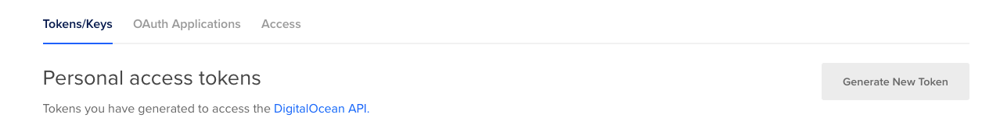
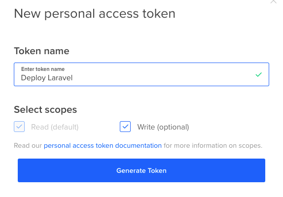

# Getting your DigitalOcean API key

Log onto your Digital ocean account.

Then click the ```Api``` menu near the bottom on the left.


Then make sure you are on the ```Tokens/Keys``` tab and click the ```Generate New Token``` button.



Clicking should bring up a box where you can give the token a name.

Leave the 'Write' checkbox ticked.



Once again, save this token somewhere save.

I would also once again create a bash function to set it.

While we are at it will also add one for TF_VAR_do_token for Terraform.

Here is an example.

```shell
setDOLvDepProfile() {  
  export DIGITALOCEAN_TOKEN="MY_DO_TOKEN"
  export TF_VAR_do_token="${DIGITALOCEAN_TOKEN}"
}
```
